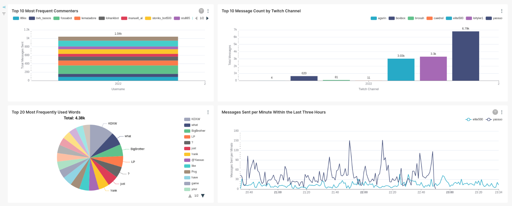

### Hi there 👋!
🔭 I'm David, a data engineer working towards being able to architect and build highly-scalable, robust, and maintainable systems.

<!--
**DavidJS01/DavidJS01** is a ✨ _special_ ✨ repository because its `README.md` (this file) appears on your GitHub profile.

Here are some ideas to get you started:

-  I’m currently working on ...
- 🌱 I’m currently learning ...
- 👯 I’m looking to collaborate on ...
- 🤔 I’m looking for help with ...
- 💬 Ask me about ...
- 📫 How to reach me: ...
- 😄 Pronouns: ...
- ⚡ Fun fact: ...
-->
---
#### About me
💬 This Github profile is a collection of projects developed as I continuously learn towards achieving that goal.

💻 I have professional experience with Python, Go, SQL (snowflake), Airflow, and more. You can view my full resume here: [resume](resume/resume.pdf)

🌱 I have a little over a year of professional data engineering experience with a record of quickly learning and developing solutions.

---

### Notable Projects

 <strong> Go-Twitch-Analytics</strong>

[Go-Twitch Analytics](https://gitfront.io/r/David-Shipman/PpqVUM9GjvYW/goTwitch-Analytics/) is an event-based, streaming analytics solution to subscribe to and aggregate chat data from a list of your favorite Twitch.tv livestreams, visualized in near real time. Built with Go, Postgres, Docker, RabbitMQ, and Apache Superset.

Example Dashboard
